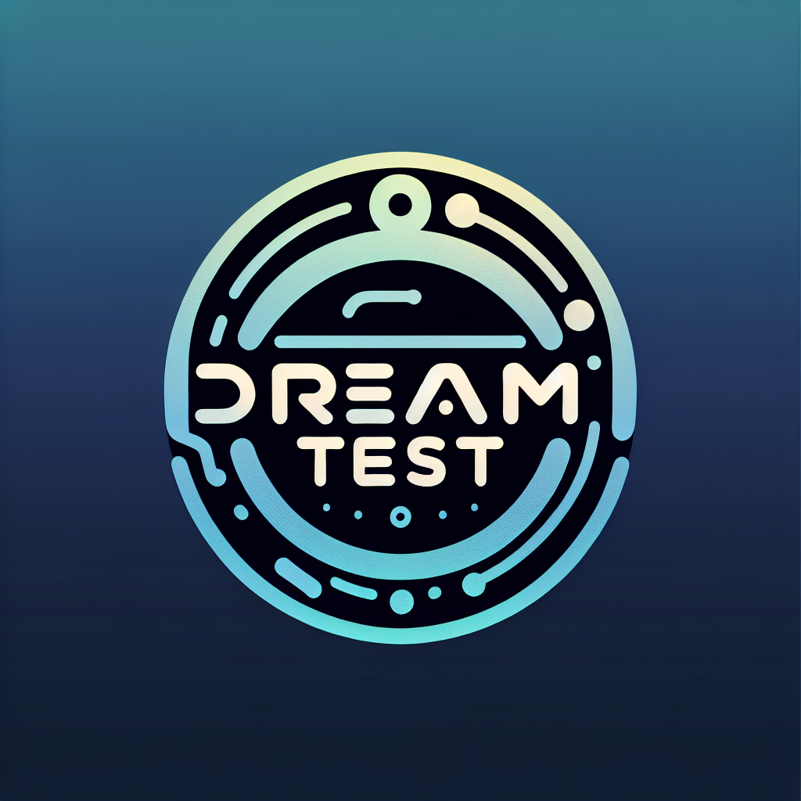

# DreamtestAI  
### A Secure Code Review Collaborator
[](https://github.com/findthehead/DreamtestAI/stargazers)
[](https://github.com/findthehead/DreamtestAI/issues)
[](https://github.com/findthehead/DreamtestAI/network/members)
[](LICENSE)



**DreamtestAI** is an AI-powered secure code review tool that scans your codebase using modern LLMs and generates vulnerability reports in Markdown, JSON, or CSV format. Ideal for security analysts, auditors, or developers looking to automate secure code review.

---

## Features

- Supports OpenAI, Claude, Gemini, and Ollama-compatible local models
- Parses all files in a directory and sends code with line numbers to the AI
- Displays Markdown-styled vulnerability reports in the terminal
- Shows progress with a dynamic progress bar
- Outputs structured results to JSON and CSV formats
- Highlights file names, line numbers, and vulnerable lines for each issue
- Simple CLI interface with rich formatting

---

## Installation

```bash
git clone https://github.com/findthehead/DreamtestAI.git
cd DreamtestAI
pip install -r requirements.txt
```


## Usage

```bash
python main.py --folder ./your/codebase
```

DreamTest works fine with `qwen2.5-coder:latest` (local model via Ollama).

### Optional arguments

```bash
--model             Specify model name (e.g. openai/gpt-4, claude-3-opus, gemini-1.5-pro)
--folder            Path to the source code folder to analyze
--output-json       Save results to vulnerabilities.json
--output-csv        Save results to vulnerabilities.csv
--debug             Enable debug logging
```

---

### Example (with default local model)

```bash
python main.py --folder ./src
```

### Example (with OpenAI)

```bash
python main.py --folder ./src --model openai/gpt-4 --output-json --output-csv
```

---

## Output Formats

### Terminal (Markdown)

DreamTest prints the findings in a readable Markdown format.

### JSON

```json
[
  {
    "file": "login.js",
    "issue": "Insecure Redirect",
    "line": "88",
    "code": "window.location.href = userInput;"
  }
]
```

### CSV

| File Name | Issue             | Line Number | Line Text                          |
| --------- | ----------------- | ----------- | ---------------------------------- |
| login.js  | Insecure Redirect | 88          | window.location.href = userInput; |

---

## Supported Models

| Provider     | Example Models                         |
| ------------ | -------------------------------------- |
| Local/Ollama | qwen2.5-coder:latest, llama3, mistral  |
| OpenAI       | gpt-4, gpt-3.5-turbo                   |
| Claude       | claude-3-opus, claude-2.1              |
| Gemini       | gemini-1.5-pro                         |

---

## Roadmap

- HTML export
- Severity classification
- CI/CD integration
- VS Code extension

---

## License

This project is licensed under the MIT License. See [LICENSE](LICENSE) for details.

---

## Contributing

We welcome contributions! To contribute:

1. Fork the repo
2. Create a new branch
3. Submit a pull request

Please open an issue first for major feature ideas or changes.

---

## Contact

For questions or suggestions, feel free to [open an issue](https://github.com/findthehead/DreamtestAI/issues).